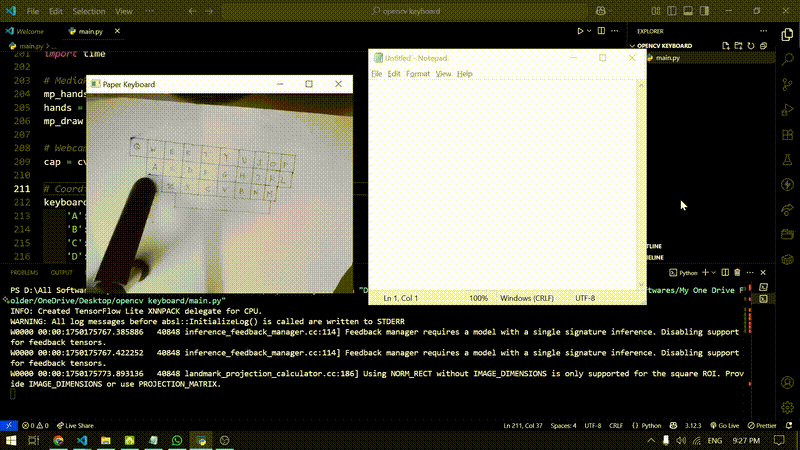
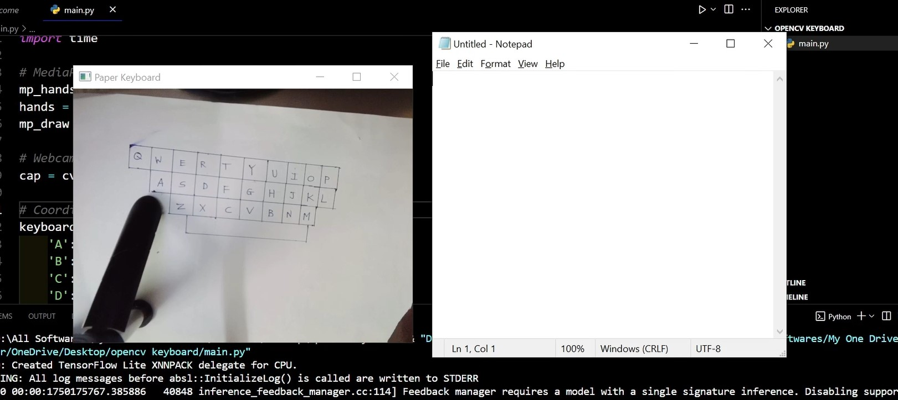
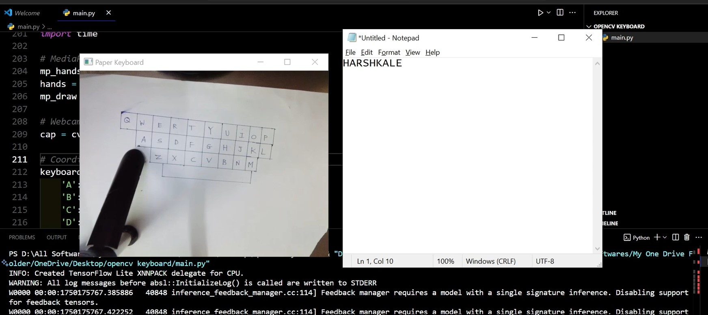

# 🧻 Paper Keyboard - A Computer Vision-Based Typing Interface

> Type on paper, powered by Python and OpenCV!

The Paper Keyboard is a low-cost, camera-powered virtual keyboard that lets you type using printed paper keys. Built using Python and OpenCV, this project tracks your finger movements over a printed keyboard layout and maps them to keystrokes in real-time.

🎯 **Why?**  
For students, makers, and curious devs who want to explore the magic of computer vision in a fun and practical way.

---

## 🎥 Demo



---

## 🚀 Features

- Finger tracking using contour detection
- Real-time key press recognition
- Printable keyboard layout (A4-friendly)
- Lightweight and easy to run on most systems
- Educational and beginner-friendly

---

## 🧠 How It Works

1. A printed paper keyboard is placed in front of the webcam.
2. OpenCV processes the camera feed to detect your fingertip(s).
3. When your finger touches a key region, it's registered as a key press.
4. The key is shown on-screen (and optionally typed via `pynput`).

---

## 🛠️ Tech Stack

- **Python 3**
- **OpenCV**
- `pynput` (for simulating keyboard presses)
- Numpy

---

## 📸 Screenshots
> Add screenshots or sample images here showing:
- Paper keyboard layout

- Key detection in action

- Terminal output or visual overlays


---

## 🖨️ Print the Keyboard

You’ll find a `keyboard_layout.pdf` in this repo. Print it on A4 paper for best results.

---

## 🔧 Installation & Setup

```bash
# Clone the repo
git clone git@github.com:Harshk133/opencv-keyboard.git
cd opencv-keyboard

# (Optional) Create virtual environment
python -m venv venv
source venv/bin/activate  # or venv\Scripts\activate on Windows

# Install dependencies
pip install opencv-python mediapipe pyautogui

# Run the app
python main.py
```

### Give A 🌟 To Repository!

